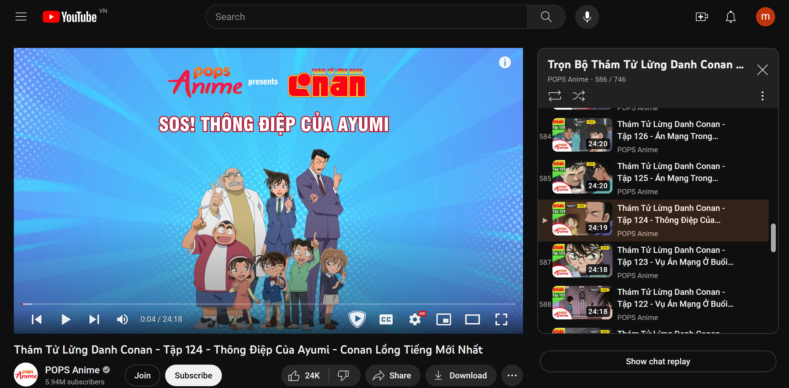
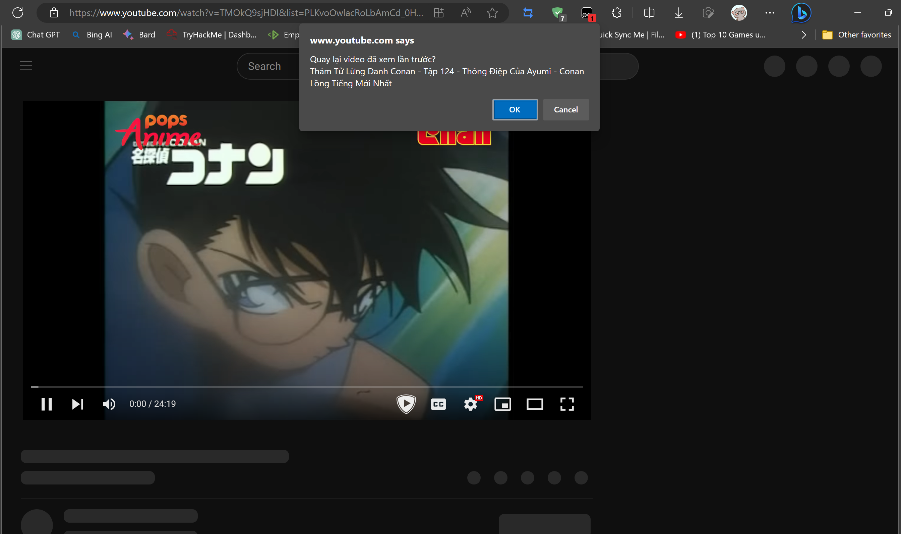

# Ghi nhớ video trong playlist của Youtube

## Đặt vấn đề bài toán

Chả là mình mới có ý định xem lại bộ Conan trên Youtube thì thấy có một cái playlist của POPS Anime, rồi phát hiện có 2
vấn đề

* Muốn xem lại từ đầu thì những tập đầu tiên nó lại nằm tít xuống cuối danh sách, kéo chuột chán chê mới xuống đến cuối
  cùng.
* Sau một vài hôm mình lại chả nhớ là mình đã xem đến tập bao nhiêu nữa.

Vậy là mình đã viết vài cái dòng code đơn giản, nhưng mà chỉ để nó chạy thôi cũng hơi lười tối ưu code;

Demo:
Ví dụ mình đang xem đến tập này

Vài ngày sau mình mới mở lại để xem tiếp

